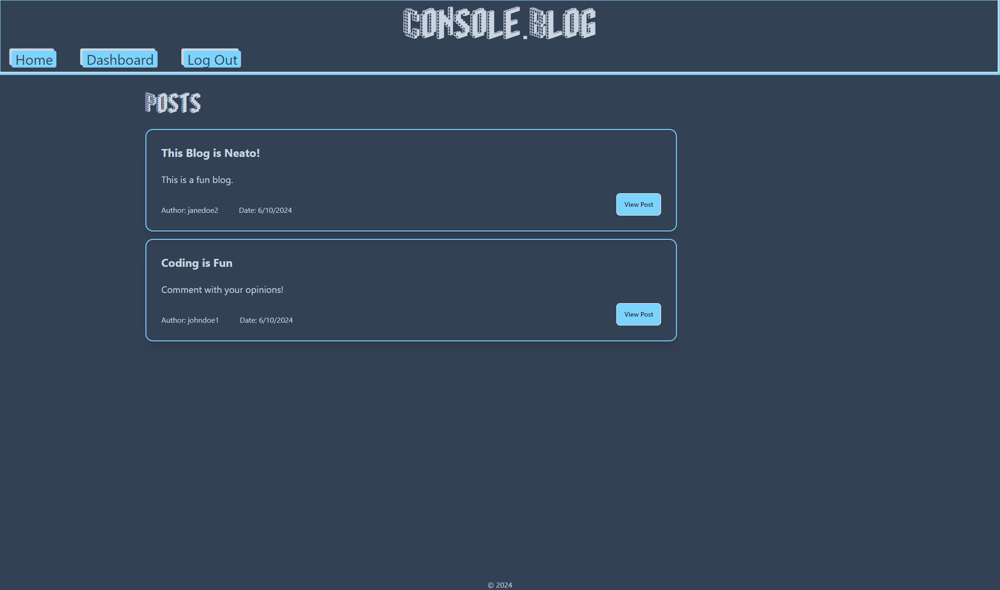
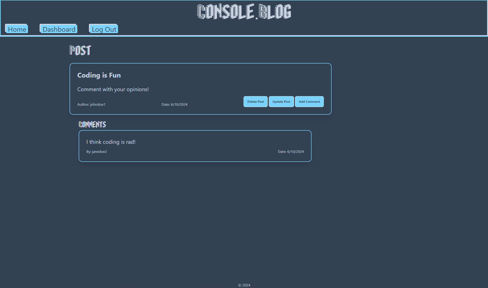

# magnificent-virtual-compositions-tech-blog

## Description

This is a project for UW Bootcamp in which we were asked to create a tech blog using a PostgreSQL database, Sequelize, and Handlebars. The app will allow users to create a user, log in and log out. While logged in, the user can create blog posts, comment on other users's posts, and update or delete their own posts. The app is deployed live using Render.

## Installation

No installation needed.

## Usage

The user will create a username and password with their email address. Once logged in, the dashboard can be accessed from the navbar at the top of the screen. Here, the user's past posts can be viewed, and they can opt to add a new post. If "View Post" is clicked on any post, the comments on that post will be displayed, and the user has the option of adding a new comment. If the post belongs to the user, they can also opt to delete or update that post. Deleting the post will delete any comments associated with it.

Link to deployed application: https://mvc-tech-blog-65rn.onrender.com/

Blog Homepage

Blog Dashboard

## Credits

- Font
  - Blox font freeware created by Brian Kent (see public/fonts/blox.txt for details)

## License

N/A

## Questions

Any questions about this application should be directed to:

GitHub: https://github.com/ktunebe

Email: ktunebe@gmail.com
